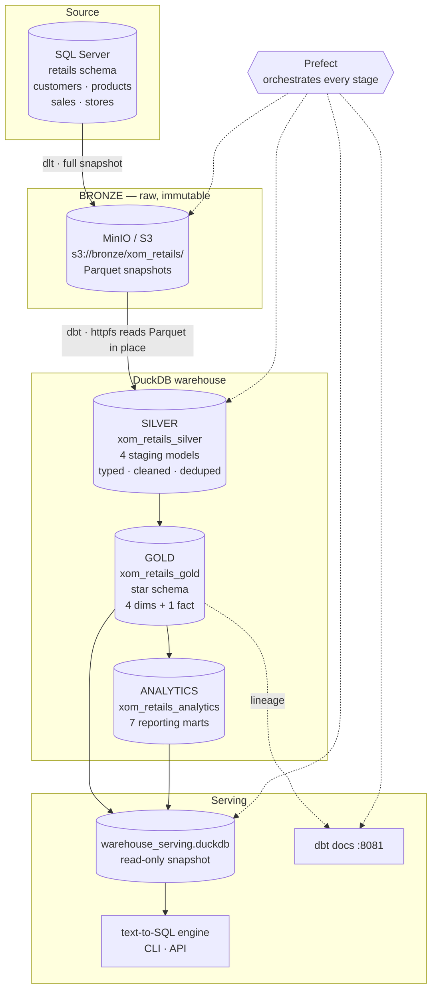
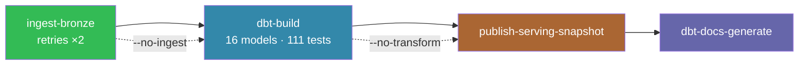
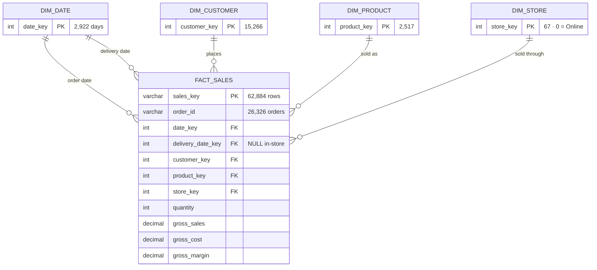
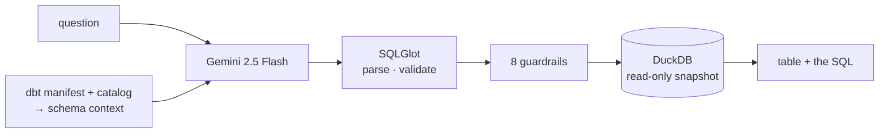

# Retail Sales Intelligence Platform

An end-to-end data platform over a retail dataset: **SQL Server → MinIO → DuckDB →
analytics → natural-language queries**. Everything runs locally on one machine, and the
whole pipeline is reproducible from a clean clone.

```
                                                        ┌──────────────────────────┐
 SQL Server  ──dlt──▶  MinIO (Bronze)  ──dbt──▶  DuckDB  │  "Which products make    │
  4 tables             Parquet            Silver + Gold  │   the most profit?"      │
  62,884 rows          s3://bronze        + analytics     │            ↓             │
                                                         │   text-to-SQL → answer   │
                                                         └──────────────────────────┘
```

**What makes it work:** 16 dbt models guarded by 111 data tests, a star schema whose grain
was settled by profiling rather than assumption, and a query engine where the LLM writes
the SQL but **DuckDB computes every number**.

---

## Contents

- [Quick start](#quick-start) · [Commands](#commands) · [Architecture](#architecture)
- [Pipeline flow](#pipeline-flow) · [Data model](#data-model) · [Data quality](#data-quality)
- [Text-to-SQL](#text-to-sql) · [Project layout](#project-layout)
- [Configuration](#configuration) · [Troubleshooting](#troubleshooting)

---

## Quick start

**Prerequisites:** Docker Desktop running, Python 3.11+, and read access to the source
SQL Server.

```bash
git clone https://github.com/phuong83033-pixel/End-to-End-Retail-Data-Platform-.git
cd End-to-End-Retail-Data-Platform-
python -m venv venv
```

```bash
make setup
```

Copy `.env.example` to `.env` and fill in the five `OLTP_*` values. Everything else has a
working default.

```bash
make up
```

```bash
make pipeline
```

That last command does the whole thing: extract → load to Bronze → build Silver, Gold and
analytics → run 111 tests → publish the serving snapshot → regenerate the lineage site.
It takes about 30 seconds.

```bash
make ask q="top 5 products by profit"
```

### On Windows

`make` is not installed by default. A PowerShell shim provides the identical targets:

```powershell
.\make.ps1 setup
.\make.ps1 pipeline
.\make.ps1 ask "top 5 products by profit"
```

Everything below works with either `make <target>` or `.\make.ps1 <target>`.

---

## Commands

| Command | What it does |
|---|---|
| `make setup` | Install dependencies, dbt packages, create directories |
| `make up` / `make down` | Start / stop MinIO, Prefect, dbt docs |
| `make status` | Container health and warehouse row count |
| **`make pipeline`** | **Full run: ingest → build → snapshot → docs** |
| `make refresh` | Rebuild the warehouse from Bronze already in MinIO (skips extraction) |
| `make ingest` | Extraction only. `tables="sales"` for one table |
| `make build` | dbt models + tests. `select=marts` to narrow |
| `make test` | Data tests only |
| `make docs` | Regenerate the lineage site |
| `make snapshot` | Publish the serving snapshot |
| `make serve` | Register the flow for UI-triggered runs |
| **`make ask q="..."`** | **Ask a question in English** |
| `make shell` | Interactive question shell |
| `make api` | HTTP API on `:8000` |
| `make eval` | Measure text-to-SQL accuracy |
| `make schema` | Print the schema context sent to the model |
| `make clean` | Remove build artefacts and the local warehouse |

### Web interfaces

| URL | What |
|---|---|
| http://localhost:8081 | **dbt docs** — lineage DAG, column docs, test coverage |
| http://localhost:4200 | **Prefect** — run history, timings, failures |
| http://localhost:9002 | **MinIO** — the Bronze Parquet files (`minioadmin` / `minioadminpassword`) |
| http://localhost:8000/docs | **API** — interactive OpenAPI docs (after `make api`) |

---

## Architecture



### The stack, and why each piece

| Layer | Tool | Why |
|---|---|---|
| Ingestion | **dlt** | Schema inference and full-snapshot replace, so re-running is idempotent |
| Object storage | **MinIO** | S3 API locally; Bronze stays raw and re-readable |
| Format | **Parquet** | Columnar, compressed, read directly by DuckDB |
| Transformation | **dbt Core** | Version-controlled SQL with tests and lineage as first-class |
| Warehouse | **DuckDB** | No server to run — an embedded file that is fast on this data size |
| Orchestration | **Prefect** | Run history and retries; each stage independently re-runnable |
| Query layer | **Gemini + SQLGlot** | Free tier, and SQL validated before it ever executes |
| Local infra | **Docker Compose** | One command for MinIO, Prefect and the docs site |

---

## Pipeline flow

Each stage has its own switch, so nothing that already succeeded has to be repeated.



| Stage | What happens | Why it is built this way |
|---|---|---|
| **ingest-bronze** | Streams four tables from SQL Server in 1,000-row batches, stamps `ingested_at_utc` / `source_system` / `source_table`, writes Parquet to MinIO | Retries twice — the only stage crossing an external network. The load is `replace`, so a retry cannot duplicate rows |
| **dbt-build** | Silver → Gold → analytics, running every test in dependency order | A failed test fails the build, so bad data never reaches the serving layer |
| **publish-snapshot** | Copies the warehouse to `warehouse_serving.duckdb` | DuckDB allows one writer. Without this, a query session blocks the next build and vice versa. The snapshot only ever holds data that passed all 111 tests |
| **dbt-docs** | Regenerates the lineage site | nginx serves the folder, so no container restart is needed |

```bash
make pipeline                   # everything
make refresh                    # skip extraction, rebuild from Bronze
make ingest tables="sales"      # one table
make build select=marts         # one dbt selection
```

Every run appears in the Prefect UI with per-stage logs and timings.

---

## Data model

Star schema in `xom_retails_gold`:



> **Grain: one row per order line** — one product within one order. Established by
> profiling, not assumed: 62,884 rows equal 62,884 distinct `(order_number, line_item)`
> pairs across 26,326 orders.

### Analytics marts — `xom_retails_analytics`

These turn the common questions into single-table lookups.

| Mart | Rows | Answers |
|---|---|---|
| `rpt_product_performance` | 2,517 | best sellers, most profitable, margin % |
| `rpt_category_performance` | 32 | revenue and margin by category/subcategory |
| `rpt_store_performance` | 67 | revenue, AOV, revenue per m² |
| `rpt_customer_performance` | 15,266 | spend, order count, AOV, repeat flag |
| `rpt_monthly_revenue` | 62 | revenue and profit over time |
| `rpt_subcategory_affinity` | 992 | what sells together |
| `rpt_product_affinity` | 7,360 | product pairs (weak signal — see below) |

### What profiling changed

Five findings that would otherwise have produced confidently wrong answers:

| Finding | Consequence |
|---|---|
| 62,884 rows but only **26,326 orders** | Counting orders with `COUNT(*)` overstates by **2.4×**. Every layer enforces `COUNT(DISTINCT order_id)` |
| `delivery_date` NULL in **79%** of rows | Not dirty data — only the online store records one. A singular dbt test asserts the rule in both directions instead of a wrong `not_null` |
| Sales on only **1,641 of 1,878** days | `dim_date` is generated, never derived from the fact, or every time series would have holes |
| `store_key = 0` is Online, with NULL `square_meters` | `dim_store.is_online` exists so revenue-per-m² never divides by NULL |
| Strongest product pair co-occurs **5 times** | Product-level basket analysis is noise. Subcategory level gives 1,548 — that is the model to use |

Full detail: [`docs/data_dictionary.md`](docs/data_dictionary.md) and
[`docs/data_model.md`](docs/data_model.md).

### Known limitation

The source records **no price at transaction time**, so `fact_sales` measures use each
product's *current* price and cost. Revenue and margin are an approximation at a fixed
price point, not restated history. All amounts are USD.

---

## Data quality

**111 tests. `make build` fails if any of them does.**

- **Keys** — `unique` + `not_null` on every dimension PK; composite key on `(order_number, line_item)`
- **Referential integrity** — `relationships` from `fact_sales` to all four dimensions, both date roles included
- **Ranges** — `quantity` 1–10, prices strictly positive, `gross_sales > 0`
- **Business rules** — `gross_margin = gross_sales − gross_cost`; `delivery_date >= order_date`; a delivery date exists **iff** the order is online
- **Reconciliation** — every analytics mart must total the same revenue as `fact_sales` ($55,755,479.59). This catches fan-out joins that double-count, which a mart hides well on its own
- **Idempotency** — a `qualify row_number()` guard in each staging model means a duplicated Bronze snapshot cannot duplicate rows

---

## Text-to-SQL

Ask questions in English. The LLM writes the query; **DuckDB computes the answer**.

```bash
make ask q="Which physical stores earn the most per square meter?"
```

```sql
SELECT store_key, country, state, square_meters, revenue, revenue_per_sqm
FROM xom_retails_analytics.rpt_store_performance
WHERE NOT is_online
ORDER BY revenue_per_sqm DESC
LIMIT 10;
```



**Why not just feed the data to the model?** Ask any LLM to sum 62,884 values and it
returns a confident, plausible, wrong number — and you cannot tell, because the reason you
asked is that you did not know the answer. So the model never sees data. It receives ~4,000
tokens of schema metadata and returns a SQL string.

The schema context is built from dbt's own `manifest.json` and `catalog.json`, so column
descriptions and foreign keys come along automatically and **cannot drift** from the
warehouse.

**Safety is enforced in code, not by prompting** — 17/17 adversarial queries blocked in
testing, including two holes a read-only connection does *not* close: `COPY ... TO` writes
files, and `read_parquet()` reads arbitrary paths.

Works with no API key (offline rule engine). For arbitrary questions, add a free
[AI Studio key](https://aistudio.google.com/apikey) to `.env`:

```
LLM_PROVIDER=gemini
GOOGLE_API_KEY=your-key-here
```

Full documentation: [`text2sql/README.md`](text2sql/README.md).

---

## Project layout

```text
.
├── Makefile · make.ps1          task shortcuts (PowerShell shim for Windows)
├── docker-compose.yaml          MinIO · Prefect · dbt docs
├── requirements.txt · .env.example
├── config.py                    single source of credentials, reads .env
│
├── Ingestion/ingestion.py       dlt pipeline: SQL Server → Bronze Parquet
│
├── dbt/
│   ├── models/silver/           4 staging models — typed, cleaned, deduped
│   ├── models/gold/             dim_customer · dim_product · dim_store
│   │                            dim_date · fact_sales
│   ├── models/analytics/        7 rpt_* reporting marts
│   └── tests/                   singular business-rule tests
│
├── text2sql/                    schema · prompts · generator · executor · cli · eval
├── api/main.py                  FastAPI: /health · /schema · /ask
├── orchestration/prefect/flows/ the pipeline flow
└── docs/                        data dictionary · data model + ERD
```

---

## Configuration

One file: `.env` (copy from `.env.example`). Only the `OLTP_*` values are required.

| Variable | Default | Purpose |
|---|---|---|
| `OLTP_HOST` `OLTP_PORT` `OLTP_DATABASE` `OLTP_USERNAME` `OLTP_PASSWORD` | — | **Required.** Source SQL Server |
| `OLTP_SCHEMA` | `retails` | Source schema |
| `MINIO_ENDPOINT` … | match docker-compose | Bronze object storage |
| `DUCKDB_PATH` | `<repo>/duckdb_warehouse/warehouse.duckdb` | Leave unset; absolute path if changed |
| `LLM_PROVIDER` | auto | `gemini` or `rules` |
| `GOOGLE_API_KEY` | — | Enables Gemini |
| `TEXT2SQL_MAX_ROWS` / `TEXT2SQL_TIMEOUT_S` | `100` / `10` | Query caps |

`.env` is git-ignored. No credentials are committed — the only ones in the repo are the
MinIO dev defaults, which are local-only by design.

---

## Troubleshooting

**`docker ps` fails with a named-pipe error** — Docker Desktop is not running. It can also
report the process as up while the engine is still starting; wait for it to come ready.

**dbt cannot read `s3://bronze/...`** — check MinIO is up (`make status`). DuckDB also
downloads the `httpfs` extension on first use, which needs internet access.

**`Cannot open the warehouse … Connection Error`** — DuckDB allows one writer. Close any
notebook or query session holding the file, or query the serving snapshot instead, which
exists precisely to avoid this.

**dbt sees no data** — the Bronze folders are `customers`, `products`, `sales`, `stores`.
An early version used singular names; delete any stale folders from the bucket.

**The engine answers vaguely or refuses** — you are on the offline rule engine, which
matches nine patterns. Add `GOOGLE_API_KEY` for arbitrary questions.

**`make` is not recognised (Windows)** — use `.\make.ps1 <target>`.

---

## Status

| Milestone | State |
|---|---|
| 0 — Profiling & architecture | Complete — dictionary, model, ERD |
| 1 — Ingestion & Bronze | Complete — idempotent, retried, orchestrated |
| 2 — Silver & Gold | Complete — 16 models, 111 tests passing |
| 3 — Analytics | Complete — 7 marts (Metabase skipped in favour of text-to-SQL) |
| 4 — Query layer | Complete — CLI, API, eval harness |
| 5 — Serving | API done; Streamlit UI not built |
