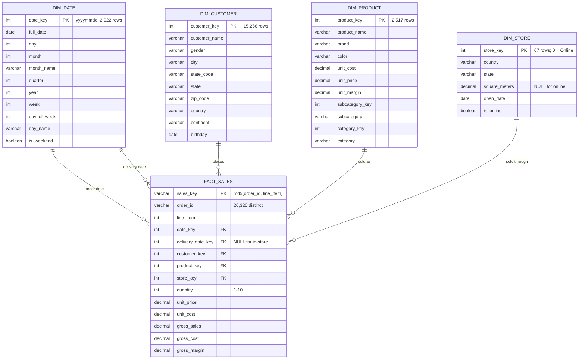

# Data Model

The warehouse is a Kimball star schema in `xom_retails_gold`, built from `xom_retails_silver`,
which reads the Bronze Parquet in MinIO. Every design choice below is traceable to a
profiling result, not an assumption — see [data_dictionary.md](data_dictionary.md).

---

## ERD



---

## Grain

> **`fact_sales`: one row = one order line = one product purchased within one order.**

Established by profiling, not assumed: 62,884 rows equal 62,884 distinct
`(order_number, line_item)` pairs across 26,326 orders — average 2.39 lines per order,
maximum 7. Zero duplicates on that pair.

The natural key `(order_number, line_item)` is replaced in the fact by a surrogate
`sales_key = md5(order_id, line_item)`, with `order_id` retained so order-level analysis
(basket size, average order value) stays possible without a separate `dim_order`.

Note for basket analysis: **75 `(order_number, product_key)` pairs appear on more than
one line of the same order.** That does not break the grain, but any transaction matrix
must aggregate to distinct products per order first.

---

## Layer flow

```text
SQL Server retails.*
      │  dlt, full snapshot (write_disposition="replace")
      ▼
BRONZE   s3://bronze/xom_retails/<table>/*.parquet
      │  dbt-duckdb via httpfs; external_location on the source
      ▼
SILVER   xom_retails_silver.stg_*        casts, trims, NULL handling, dedupe guard
      │  dbt ref()
      ▼
GOLD     xom_retails_gold.dim_* / fact_sales
```

Silver is materialised as **tables**, not views, so it is a genuinely persisted layer
rather than a pass-through to Bronze.

---

## Design decisions

**Natural keys for dimensions.** `customer_key`, `product_key` and `store_key` are unique
and complete in the source, and referential integrity is perfect — 0 orphans from
`fact_sales` on any of the three. Surrogate dimension keys would add indirection for no
benefit at this scale. `relationships` tests guard the assumption on every build.

**No SCD Type 2.** The source carries no history for customers, products or stores — one
current row each, no effective dates. Type 2 would be fabricating change tracking that
the source cannot support.

**`dim_date` is generated, not derived.** Sales occur on only 1,641 of the ~1,878 calendar
days in range. A calendar built from the fact would silently drop the other 237 days and
break any running total, month-over-month or seasonality analysis.

**`delivery_date_key` is nullable, and that is enforced as a rule.** Delivery dates exist
only for online orders (`store_key = 0`) — 13,165 online lines all have one, 49,719
in-store lines all do not. Instead of a `not_null` test (which would fail on correct data)
or no test at all (which would hide corruption), `tests/assert_delivery_only_for_online_orders.sql`
asserts the biconditional in both directions.

**`dim_store.is_online`.** Store 0 is the only store with NULL `square_meters`. The flag
lets revenue-per-square-meter exclude it explicitly rather than dividing by NULL, and
separates channel analysis from geography.

**Category hierarchy denormalised into `dim_product`.** 8 categories and 32 subcategories,
strictly hierarchical. Separate dimensions would add joins without adding information at
V1 scale.

**`fact_sales` LEFT joins `dim_product`.** An inner join would silently drop revenue if a
product key ever went missing. The left join plus a `not_null` test on `unit_price` turns
that same event into a loud test failure.

---

## Open questions from the original plan, now answered

| Question (`implementation_plan.md` §18) | Answer |
|---|---|
| Exact grain of `sales`? | One order line |
| Real primary key of `sales`? | `(order_number, line_item)` |
| Relationship to customers/products/stores? | Simple many-to-one FKs, 0 orphans |
| Enough timestamp granularity for forecasting? | Daily dates, 62 months — but see the caveat below |
| Enough history to train a forecast? | 2016-01-01 → 2021-02-20, 5 years, last month partial |
| Enough price/cost to compute margin? | Yes, but at *current* prices only |
| SCD Type 2 needed? | No — source has no history |
| Keep `order_id` in the fact or build `dim_order`? | Kept in the fact; no order-level attributes exist to justify a dimension |
| Is DuckDB the final warehouse? | Yes for this project — local-first, no server to run |
| Is Prefect needed from day one? | No; added after the pipeline was stable |

**Forecasting caveat:** products average 25 line items across the *entire five years*
(median 15), and 75% of product-months have no sale at all. Per-product demand
forecasting is not viable on this data — any forecasting work must aggregate to category
or total level. This is recorded here so it is not rediscovered late.
