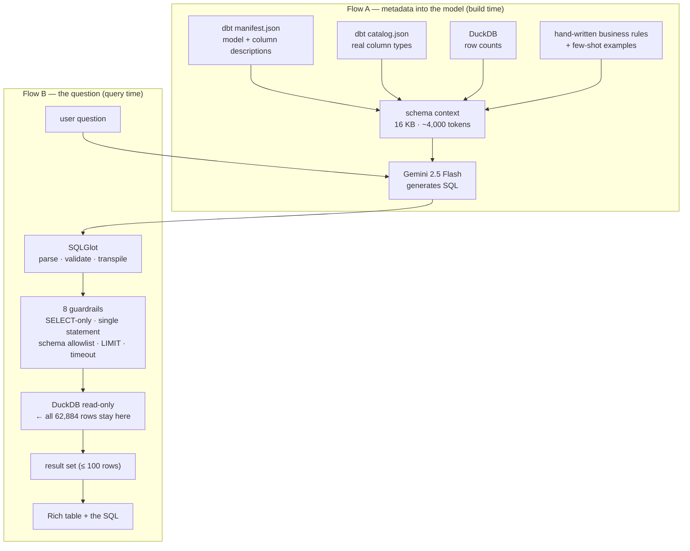

# Text-to-SQL Engine

Ask the retail warehouse questions in plain English. An LLM writes DuckDB SQL against
the star schema, DuckDB executes it read-only, and you get a table back **plus the query
that produced it**.

```
$ python -m text2sql "Which subcategories are usually bought together?"

SELECT antecedent_subcategory, consequent_subcategory, pair_order_count, confidence, lift
FROM xom_retails_analytics.rpt_subcategory_affinity
ORDER BY pair_order_count DESC
LIMIT 10;

antecedent_subcategory  consequent_subcategory  pair_order_count  confidence  lift
Movie DVD               Desktops                1548              0.246       0.869
Desktops                Movie DVD               1548              0.3283      0.869
Movie DVD               Bluetooth Headphones    1031              0.1638      0.8292
...
10 row(s) in 2.7 ms
```

---

## Table of contents

1. [Why this exists, and why not a trained model](#1-why-this-exists)
2. [The core principle](#2-the-core-principle)
3. [How the data moves](#3-how-the-data-moves)
4. [How it works, module by module](#4-how-it-works-module-by-module)
5. [What the model is told](#5-what-the-model-is-told)
6. [Safety: what is enforced and what we proved](#6-safety)
7. [How to run it](#7-how-to-run-it)
8. [Evaluation](#8-evaluation)
9. [How it was built, phase by phase](#9-how-it-was-built)
10. [Source code](#10-source-code)
11. [Known limits](#11-known-limits)
12. [Credits](#12-credits)

---

## 1. Why this exists

The original Milestone 4 plan was three machine-learning models: market basket analysis,
a recommender, and demand forecasting. Profiling the warehouse killed two of them and
weakened the third.

| Planned model | What the data actually shows | Verdict |
|---|---|---|
| Demand forecasting | Products average **25 sales across five years** (median 15). 75% of product-months have zero sales | Not viable at product level. Would need category-month aggregation, giving 496 points |
| Market basket | The strongest product pair co-occurs in **5 orders**. 91% of surviving pairs co-occur exactly twice | No product-level signal. Rolled up to subcategory it works, and is a `GROUP BY` — no mining library needed |
| Recommendation | Median customer buys **4 distinct products**; only 117 customers ever rebought the same product | Feasible but thin. Latent-factor models have very little to learn from |

Meanwhile the questions actually being asked — *what makes the most profit, what sells
together, best sellers, total revenue* — are not ML questions at all. They are `GROUP BY`
and `SUM`. The useful thing to build was not a model but an **interface**: something that
turns an English question into the right aggregation.

### Why the LLM does not "analyse the data"

The obvious idea is to feed the data to Gemini and ask it questions. That does not work,
for a reason that matters:

> Ask any language model to sum 62,884 margin values and it returns a confident,
> plausible, **wrong** number — and you cannot tell it is wrong, because the reason you
> asked is that you did not know the answer.

Language models are unreliable arithmetic engines and excellent language parsers. So the
LLM never sees the data. It writes the query; the database does the maths.

---

## 2. The core principle

> **The LLM writes the query. DuckDB computes the answer.**

Everything in this design follows from that one split. The model receives a few kilobytes
of *schema metadata* and returns a SQL string. All 62,884 rows stay in DuckDB.

---

## 3. How the data moves

Two distinct flows. Conflating them is the main way this architecture goes wrong.



**What crosses the wire:** table and column names, types, descriptions, join keys, and the
user's question. A few kilobytes of metadata — never bulk data.

**What comes back:** a SQL string.

**Where the data lives:** DuckDB, always.

### The schema context is nearly free

`dbt/target/manifest.json` holds every model and column description; `catalog.json` holds
the real column types. Both are regenerated by `dbt docs generate`, **which the Prefect
flow already runs as its last stage**. So the model's view of the warehouse updates itself
whenever the pipeline runs. There is no separate schema file to maintain and drift.

This is a real advantage over the reference design, which introspects raw DDL. Raw DDL
says `gross_margin` is a `DECIMAL`. Our manifest says *what it means* — and description
quality is the single biggest lever on text-to-SQL accuracy.

### Join keys come from the tests

dbt's `relationships` tests already assert every foreign key on each build, so the join
map is extracted from them rather than hand-written:

```
-- JOIN KEYS (verified by dbt relationship tests on every build)
--   fact_sales.customer_key      -> dim_customer.customer_key
--   fact_sales.date_key          -> dim_date.date_key
--   fact_sales.delivery_date_key -> dim_date.date_key
--   fact_sales.product_key       -> dim_product.product_key
--   fact_sales.store_key         -> dim_store.store_key
--   ... 8 total
```

These cannot rot: if a join key changes, the dbt test fails *and* the context updates.

---

## 4. How it works, module by module

```
text2sql/
├── schema.py      builds the schema context from dbt artefacts
├── prompts.py     business rules + verified few-shot examples
├── generator.py   Gemini / offline backends + SQLGlot validation
├── executor.py    read-only execution behind 8 guardrails
├── cli.py         Rich terminal interface
├── __main__.py    `python -m text2sql`
└── eval/
    ├── questions.yml   22 cases with reference queries
    └── run_eval.py     compares RESULTS, never SQL text
```

| Module | Responsibility |
|---|---|
| **`schema.py`** | Reads `manifest.json` + `catalog.json`, joins them per column, queries DuckDB for row counts, extracts FK edges from relationship tests, and renders annotated `CREATE TABLE` DDL. Cached against the manifest's mtime: 0.14 ms warm vs 32 ms cold. Degrades gracefully when the warehouse is locked — a missing row count beats a crashed build. |
| **`prompts.py`** | The system instruction: nine business rules and six few-shot examples. The examples are executed against the live warehouse by the test suite, so a broken one fails CI rather than quietly teaching the model bad SQL. |
| **`generator.py`** | `GeminiGenerator` (hosted) and `RuleBasedGenerator` (offline) behind one `SQLGenerator` protocol. Output goes through SQLGlot: parsed to an AST, transpiled to DuckDB, pretty-printed. |
| **`executor.py`** | Where every safety guarantee lives. Validates the AST, applies the schema allowlist, injects `LIMIT`, and runs the query on a worker thread with an interrupt watchdog. |
| **`cli.py`** | Single-question and interactive modes. Always prints the SQL beside the answer. |
| **`eval/`** | Executes generated SQL *and* a known-correct reference, then compares results. |

### Why Gemini only

`gemini-2.5-flash` on the Google AI Studio free tier: 15 requests/minute, 1,500/day, no
payment details. Anyone who clones this repo can run the engine without an API bill. The
`SQLGenerator` protocol keeps adding another provider a small change.

Without any key the engine still starts and falls back to the offline rule engine, so the
CLI, API and eval harness all work with zero configuration.

---

## 5. What the model is told

The schema says what exists; these rules say what the data *means*. Each one exists
because without it the engine produces an answer that is wrong in a way the reader cannot
detect — which is far worse than an error.

| Rule | Why it is load-bearing |
|---|---|
| **Grain**: `fact_sales` has one row per **order line** — 62,884 rows across 26,326 orders. Count with `COUNT(DISTINCT order_id)` | "How many orders in 2019?" via `COUNT(*)` is wrong by **2.4×** and looks entirely reasonable |
| **Profit** = `gross_margin`, computed at **current** prices | The source records no transaction-time price, so margin trends reflect today's prices, not history |
| **Delivery dates** are NULL for in-store orders by design | Filtering or inner-joining on them silently drops 79% of rows |
| **Customers**: 15,266 exist, only 11,887 ever purchased | "Average revenue per customer" means two very different things |
| **Stores**: `store_key = 0` is the online channel with NULL `square_meters` | Revenue-per-square-meter must exclude it |
| **Dates**: `date_key` is an integer `yyyymmdd`, not a date | Forces the join to `dim_date` instead of a broken cast |
| **Coverage**: 2016-01-01 → 2021-02-20, February 2021 partial | Stops "current year" filters that return nothing, and trend answers that read a truncated month as a collapse |
| **Currency**: everything is USD | Prevents invented conversion |
| **Prefer the `rpt_*` marts** | Most questions become a single `SELECT` with no joins |

Plus six few-shot examples covering the common shapes. Two are chosen specifically to
teach traps: `COUNT(DISTINCT order_id)` and `WHERE NOT is_online`.

### The analytics marts

Phase 0 built seven pre-aggregated marts, because the reference project's examples all
query pre-built answer tables — which is *why they all work*. Turning the hardest
questions into single-table lookups is the highest-leverage accuracy work available.

| Mart | Rows | Answers |
|---|---|---|
| `rpt_product_performance` | 2,517 | best sellers, most profitable, margin % |
| `rpt_category_performance` | 32 | revenue and margin by category/subcategory |
| `rpt_store_performance` | 67 | revenue, AOV, revenue per m² |
| `rpt_customer_performance` | 15,266 | spend, order count, AOV, repeat flag |
| `rpt_monthly_revenue` | 62 | revenue and profit over time |
| `rpt_product_affinity` | 7,360 | product pairs (weak signal — see limits) |
| `rpt_subcategory_affinity` | 992 | **what actually sells together** |

All five revenue marts reconcile to **$55,755,479.59**, matching `fact_sales` to the cent.
A dbt test (`assert_analytics_revenue_reconciles`) fails the build if any mart drifts —
the guard against a fan-out join quietly double-counting, which a mart hides well on its own.

---

## 6. Safety

Eight guardrails, enforced **in code**. A prompt is a suggestion; an AST check is not.

| # | Guardrail | Blocks |
|---|---|---|
| 1 | Read-only connection | `CREATE`, `INSERT`, `UPDATE`, `DELETE` |
| 2 | Single statement | `SELECT 1; DROP TABLE ...` |
| 3 | SELECT-only AST, checked recursively | writes hidden inside subqueries |
| 4 | Explicit `COPY` rejection | file exfiltration — **see below** |
| 5 | Schema allowlist | `main.sqlite_master`, `read_parquet('C:/...')`, unqualified tables |
| 6 | Function allowlist (945 DuckDB functions) | `ISNULL()` and other foreign-dialect functions |
| 7 | `LIMIT` injection (default 100) | runaway result sets |
| 8 | Statement timeout via `con.interrupt()` | cartesian joins hanging the process |

**Verified: 17/17 adversarial queries blocked, no files written.**

### Two holes found by probing, not by assuming

Before writing the executor I tested what `read_only=True` actually guarantees.

**`read_only` does not block `COPY ... TO`.** On DuckDB 1.5.5 a read-only connection
happily wrote a file to disk. A generated `COPY (SELECT * FROM fact_sales) TO 'x.csv'`
would have exfiltrated the entire warehouse. Guardrail 4 exists because of this.

**`read_parquet()` reads arbitrary paths.** It was attempted successfully — it only failed
because the target file was not parquet. Point it at a real one and it reads anything the
process can. Guardrail 5 closes it, because a table function is not an allowlisted table.

Neither is covered by the reference design's "read-only at connection level" claim.

### The timeout needed a watchdog

DuckDB has no `statement_timeout`. The query runs on a worker thread and the main thread
calls `con.interrupt()` on expiry. Tested with a three-way cartesian join
(≈2.5 × 10¹⁴ rows): cancelled at 2.1 s, **and the connection stayed usable afterwards** —
an interrupt that poisoned the connection would be a nastier bug than the hang.

### Serving snapshot

DuckDB allows one writer. A query session holding the warehouse blocks `dbt build`, and a
build locks the engine out. The Prefect flow publishes `warehouse_serving.duckdb` after a
successful build, and the API reads that.

Proven: with a writer holding the main warehouse, querying it fails — and querying the
snapshot returns 62,884 rows / 26,326 orders in 6.5 ms at the same moment. The snapshot
also only ever contains data that passed all 127 tests.

---

## 7. How to run it

### Setup

```bash
pip install -r requirements.txt
```

Optional — for questions beyond the offline rules, add a free key from
[aistudio.google.com/apikey](https://aistudio.google.com/apikey) to `.env`:

```
LLM_PROVIDER=gemini
GOOGLE_API_KEY=your-key-here
TEXT2SQL_MODEL=gemini-2.5-flash
```

Leave `LLM_PROVIDER=rules` (or unset with no key) to run fully offline.

### CLI

```bash
python -m text2sql "Top 5 products by profit"     # one question
python -m text2sql                                # interactive shell
python -m text2sql --sql-only "total revenue"     # generate without executing
python -m text2sql --schema                       # dump the context sent to the model
python -m text2sql --provider rules "..."         # force a backend
```

### API

```bash
uvicorn api.main:app --reload
```

| Endpoint | Purpose |
|---|---|
| `GET /health` | status, which database, which backend |
| `GET /schema` | the tables exposed and context size |
| `POST /ask` | `{"question": "..."}` → `{sql, columns, rows, elapsed_ms, hit_limit}` |

Status codes separate the failure modes: **422** the model could not produce SQL, **400** a
guardrail refused it, **500** the database could not run it.

```bash
curl -X POST localhost:8000/ask -H 'Content-Type: application/json' \
     -d '{"question": "top 5 products by profit"}'
```

### Pipeline integration

```bash
python orchestration/prefect/flows/retail_pipeline.py
```

Runs `ingest → dbt build → publish snapshot → dbt docs`. Each stage has a switch
(`--no-ingest`, `--no-publish`, …) so nothing already done has to be repeated.

### Configuration

| Variable | Default | Purpose |
|---|---|---|
| `LLM_PROVIDER` | auto | `gemini` or `rules` |
| `GOOGLE_API_KEY` | — | enables Gemini |
| `TEXT2SQL_MODEL` | `gemini-2.5-flash` | model id |
| `TEXT2SQL_DB_PATH` | serving snapshot, else live | database to query |
| `TEXT2SQL_MAX_ROWS` | `100` | injected `LIMIT` |
| `TEXT2SQL_TIMEOUT_S` | `10` | statement timeout |

---

## 8. Evaluation

```bash
python -m text2sql.eval.run_eval                 # offline baseline
python -m text2sql.eval.run_eval --provider gemini
python -m text2sql.eval.run_eval --verbose       # show generated SQL
```

22 cases in `eval/questions.yml`, each with a **reference query known to be correct**. The
harness executes both the generated SQL and the reference, then compares **results** —
never SQL text, since many different queries answer a question correctly. Exit code 0 when
everything attempted passes, so it can gate CI.

Cases deliberately include the traps: the grain trap, the customer denominator, the online
store exclusion.

**Current baseline (offline rule engine): 6/19 attempted, 3 skipped — 32%.**

That number is honest and expected. The offline engine matches nine regex patterns and
returns canned queries; it answers "total revenue" correctly and fails "revenue in 2020"
because it has no notion of filtering. The suite exists to measure the *LLM* — run it with
`--provider gemini` and a key to get a meaningful figure.

The suite proved its worth immediately by catching a bug **in its own reference data**: the
`total_profit` case referenced `SUM(gross_sales)` instead of `SUM(gross_margin)`.

---

## 9. How it was built

Seven phases, sequenced so each one rests on something already verified.

| Phase | What | Outcome |
|---|---|---|
| **0** | Analytics marts | 7 marts, 16 models, 111 tests, **127 PASS**. All revenue marts reconcile to the cent |
| **1** | `schema.py` | 16 tables · 202 columns · 16 KB (~4,000 tokens). 8 FK edges auto-extracted |
| **3** | `executor.py` | **17/17** adversarial queries blocked |
| **2** | `generator.py` | Gemini + offline backends; offline path 8/8 executed |
| **5** | `eval/` | 22 cases; caught a bug in its own reference data |
| **4** | `cli.py` | Rich output; guardrails surface correctly through it |
| **6** | Prefect + FastAPI | Snapshot publishing proven to remove lock contention |

**Executor (Phase 3) was built before the generator (Phase 2) on purpose** — so the first
LLM-written query ever executed already had guardrails around it.

### Decisions worth recording

**Documentation gaps were filled first.** `fact_sales` had 5 of 13 columns documented;
the manifest now carries 72 of 75 across all models. `gross_margin` explicitly says "use
this for any profit question". Cheapest accuracy win available.

**Product affinity is kept despite being weak.** The strongest product pair co-occurs 5
times — noise. Rather than delete the model, its description warns the LLM off it and
points at `rpt_subcategory_affinity`, where the top pair co-occurs 1,548 times.

**Dialect repair was added after finding the reference design overstated it.** The
reference claims SQLGlot converts `TOP N` → `LIMIT N`; reading as `duckdb` actually just
*rejects* it. Parsing DuckDB first and falling back through `tsql`/`postgres`/`mysql`/
`snowflake` makes the claim true. Verified on `SELECT TOP 3` and MySQL backticks.

---

## 10. Source code

Full sources live beside this file. The excerpts below are the parts that carry the
design — the rest is plumbing.

### `executor.py` — the guardrails

```python
FORBIDDEN_NODES: dict[type, str] = {
    exp.Insert: "INSERT",
    exp.Update: "UPDATE",
    exp.Delete: "DELETE",
    exp.Drop: "DROP",
    exp.Create: "CREATE",
    exp.Alter: "ALTER",
    exp.Copy: "COPY",          # writes files even on a read-only connection
    exp.Attach: "ATTACH",
    exp.Detach: "DETACH",
    exp.Command: "non-query command (PRAGMA/SET/INSTALL)",
    exp.Transaction: "transaction control",
}

def validate_sql(sql, allowed_schemas, known_functions=None) -> exp.Expression:
    statements = [s for s in sqlglot.parse(sql, dialect="duckdb") if s is not None]
    if len(statements) > 1:
        raise UnsafeQueryError(f"Only one statement may run at a time; {len(statements)} were provided.")
    expression = statements[0]

    # Forbidden nodes anywhere in the tree, including inside subqueries.
    for node_type, label in FORBIDDEN_NODES.items():
        if isinstance(expression, node_type) or expression.find(node_type):
            raise UnsafeQueryError(f"{label} is not permitted; this endpoint is read-only.")

    if not isinstance(expression, ALLOWED_ROOTS):
        raise UnsafeQueryError(f"Only SELECT queries are permitted, got {type(expression).__name__.upper()}.")

    # Every real table must sit in an allowed schema. This is also what stops
    # read_parquet('C:/anything') - a table function is not an allowlisted table.
    cte_names = _collect_cte_names(expression)          # CTEs look like unqualified tables
    for table in expression.find_all(exp.Table):
        if (table.name or "").lower() in cte_names:
            continue
        schema = (table.db or "").lower()
        if not schema:
            raise UnsafeQueryError(f"{_table_function_name(table)} cannot be queried. ...")
        if schema not in allowed_schemas:
            raise UnsafeQueryError(f"Schema `{schema}` is not accessible. ...")

    # sqlglot parses anything it does not model as Anonymous - exactly where a
    # foreign dialect's function lands.
    if known_functions is not None:
        for func in expression.find_all(exp.Anonymous):
            fname = (func.this or "").lower()
            if fname and fname not in known_functions:
                raise UnsafeQueryError(f"`{fname}()` is not a DuckDB function.")
    return expression
```

The timeout, which needs a watchdog because DuckDB has no `statement_timeout`:

```python
with ThreadPoolExecutor(max_workers=1) as pool:
    future = pool.submit(lambda: con.execute(final_sql).fetchall())
    try:
        rows = future.result(timeout=self.timeout_s)
    except FutureTimeout:
        con.interrupt()
        raise ExecutionError(f"Query exceeded the {self.timeout_s:g}s timeout and was cancelled.")
```

### `schema.py` — join keys from dbt's tests

```python
def extract_foreign_keys(manifest: dict) -> list[tuple[str, str, str, str]]:
    """Recover join keys from dbt's `relationships` tests."""
    models = _model_nodes(manifest)
    edges = []
    for node in manifest["nodes"].values():
        meta = node.get("test_metadata") or {}
        if meta.get("name") != "relationships":
            continue
        source_id = node.get("attached_node")
        targets = [n for n in node["depends_on"]["nodes"] if n != source_id and n in models]
        if source_id not in models or not targets:
            continue
        kwargs = meta.get("kwargs", {})
        edges.append((models[source_id]["alias"], node.get("column_name"),
                      models[targets[0]]["alias"], kwargs.get("field")))
    return sorted(set(edges))
```

Columns come from the **catalog**, descriptions attach from the **manifest** — that
direction matters, since the manifest lists only documented columns and building from it
would silently hide the rest of the table.

### `generator.py` — validation and dialect repair

```python
FALLBACK_DIALECTS = ("tsql", "postgres", "mysql", "snowflake")

def format_sql(raw_sql: str) -> str:
    cleaned = strip_markdown_fence(raw_sql)          # models add ```sql despite instructions
    first_error = None
    for dialect in ("duckdb", *FALLBACK_DIALECTS):
        try:
            statements = sqlglot.transpile(cleaned, read=dialect, write="duckdb", pretty=True)
        except ParseError as exc:
            first_error = first_error or exc
            continue
        if statements:
            return statements[0].strip().rstrip(";") + ";"
    raise GenerationError(f"Generated SQL failed to parse: {first_error}")
```

### `eval/run_eval.py` — comparing results, not SQL

```python
if mode == "scalar":
    expected = reference_rows[0][0]
    # Accept the expected value anywhere in the first row: a model may answer
    # "how many orders" with (label, count) rather than a bare count.
    for cell in generated_rows[0]:
        if _values_match(cell, expected):
            return True, f"= {expected}"
    return False, f"expected {expected}, got {generated_rows[0]}"
```

### `prompts.py` — the rule that prevents the worst failure

```python
BUSINESS_RULES = [
    "GRAIN: fact_sales has one row per ORDER LINE, not per order. It holds 62,884 "
    "rows across only 26,326 orders. Count orders with COUNT(DISTINCT order_id) - "
    "COUNT(*) over-counts by roughly 2.4x.",
    ...
]
```

---

## 11. Known limits

**Text-to-SQL is not solved.** Expect good accuracy on questions resembling the few-shot
examples and worse on novel phrasings. The `rpt_*` marts exist to keep common questions on
the easy path.

**Wrong-but-plausible answers are the real failure mode**, not crashes. This is why the SQL
is always displayed, why the business rules exist, and why the eval suite compares results.

**Dialect repair catches syntax, not function names.** sqlglot parses an unknown function
as a generic call, so `ISNULL(x, 0)` parses cleanly as DuckDB and never reaches the
fallbacks. Guardrail 6 catches it at validation instead, using DuckDB's own function
catalog.

**Measures use current prices.** The source has no transaction-time price, so revenue and
margin are an approximation at a fixed price point, not restated history. Every "profit
over time" answer inherits this.

**Product-level affinity is noise.** Max co-occurrence 5. Use `rpt_subcategory_affinity`.
Even there the strongest lift is 1.11 — the honest answer to "which products go together"
on this dataset is *nothing much does*.

**Schema context grows.** 16 models is comfortable at ~4,000 tokens; a hundred would need
retrieval over the schema rather than sending all of it.

**Third-party data flow.** The schema and your questions leave the machine when Gemini is
enabled. Fine for this dataset; a conscious decision if the source ever holds anything
sensitive.

---

## 12. Credits

The architecture — schema introspection → LLM → SQLGlot → read-only DuckDB → Rich output
— follows a [reference design](#) shared as prior art, whose core insight (let the LLM pick
from pre-aggregated tables rather than write arbitrary joins) shaped Phase 0.

What changed for this warehouse:

- Schema context is built from **dbt artefacts** rather than raw DDL, so column
  descriptions and FK edges come along and cannot drift
- **Nine business rules** derived from profiling, without which answers are silently wrong
- **Two security holes closed** that "read-only connection" does not cover: `COPY ... TO`
  and table functions
- **An eval suite**, which the reference design does not have
- **Gemini only**, so a clone runs free
